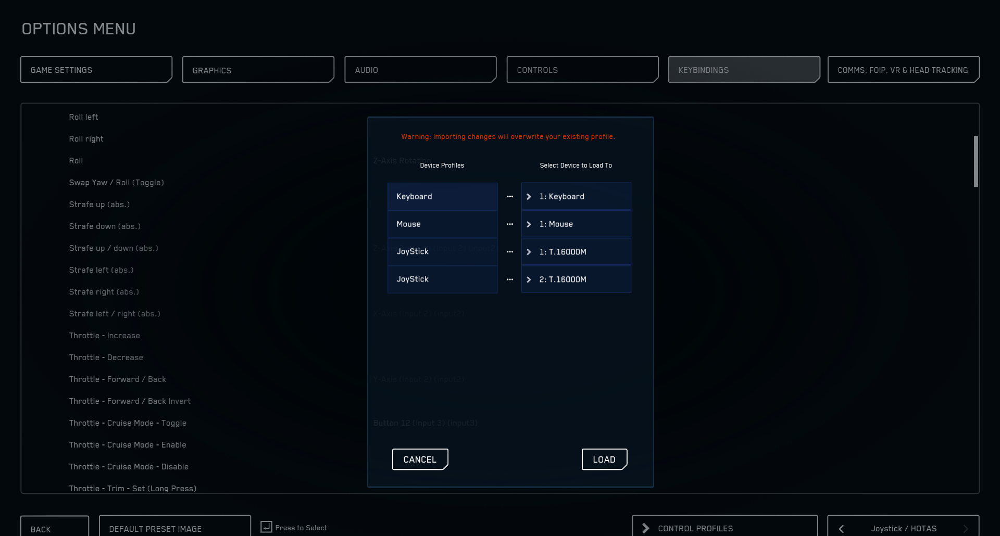
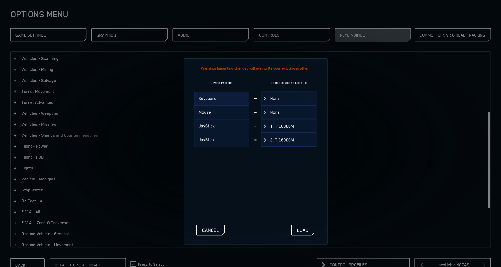
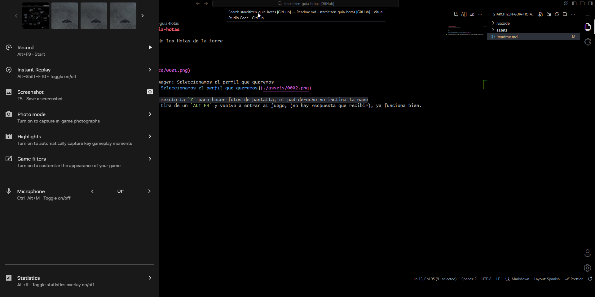

# starcitizen-guia-hotas

E: He desconectado los Hotas de la torre

S:

Paso 1:

Paso 2: Pie de imagen: Seleccionamos el perfil que queremos

E: Cuando juego; mezclo la `Z` para hacer fotos de pantalla, el pad derecho no inclina la nave
S: No te apures, tira de un `ALT F4` y vuelve a entrar al juego, (no hay respuesta que recibir), ya funciona bien.

